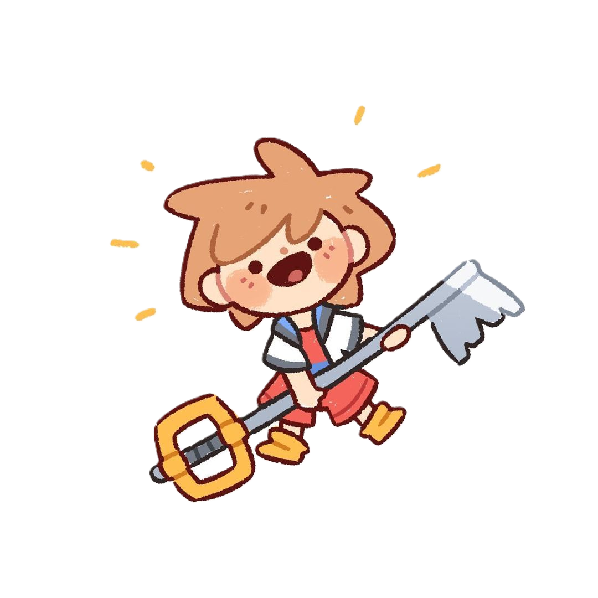
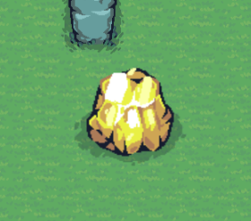
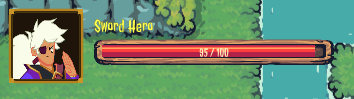
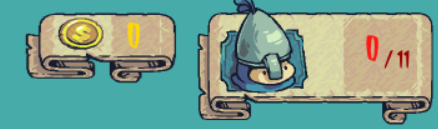
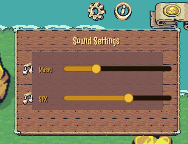
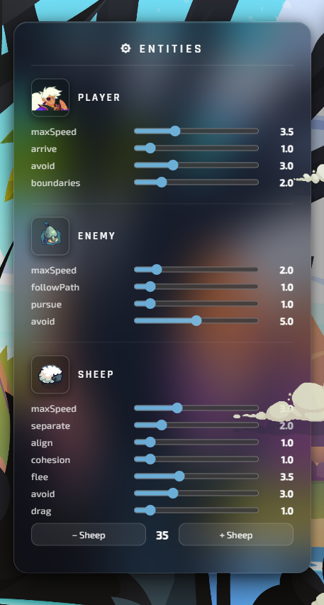
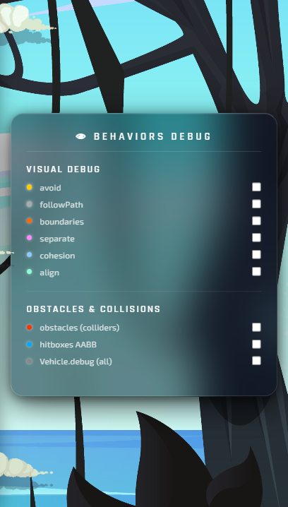

# ⚔️ The Adventure of The Sword Hero

  

<a href="https://youtu.be/tceqGfH8194"><i>Lien vers la vidéo youtube du Gameplay</i></a> &nbsp;&nbsp;&nbsp;&nbsp;&nbsp;&nbsp;&nbsp;&nbsp;  <a href="https://capatainkomic.github.io/2D-Fantasy-Adventure-Game/"><i>Lien vers le jeu deployé en ligne</i></a>  

##  Introduction

Avec l’essor récent de l’intelligence artificielle, notamment des modèles génératifs, son utilisation s’est largement répandue dans le quotidien des développeurs et plus globalement dans le domaine de l’informatique. Aujourd’hui, des outils comme ChatGPT ou GitHub Copilot permettent d’accélérer le développement, d’améliorer la qualité du code et de gagner en productivité. Par exemple, certaines études montrent que ces outils peuvent augmenter la vitesse de développement de 30 à 50 %. Cette évolution met en évidence l’importance de savoir utiliser efficacement ces technologies. 

Dans ce contexte, le prompt engineering est devenu une compétence clé : la manière de formuler une requête influence directement la qualité des résultats générés. Il devient donc essentiel de comprendre comment interagir avec une IA afin de garder le contrôle sur les réponses produites, d’en améliorer la pertinence et de les adapter à ses besoins.

Par ailleurs, les steering behaviors sont un ensemble de techniques introduites par Craig Reynolds à la fin des années 1980 pour simuler le déplacement autonome de personnages virtuels. Ces comportements permettent à des agents (appelés autonomous characters) de se déplacer de manière réaliste dans un environnement, sans suivre de trajectoire prédéfinie.

Ce projet s’inscrit dans cette double perspective : d’une part, implémenter les différentes techniques proposées par Craig Reynolds, et d’autre part, initier une réflexion sur l’utilisation efficace de l’intelligence artificielle,  travers un jeu 2D ludique.

 

##   Environnement de Développement
* **IDE** : `VS Code` 
* **Modèles IA utilisés** : `Claude 3.5 Sonnet` & `Claude 3 Haiku`
* **Librairie Graphique** : `p5.js`

 

##  Description du jeu 
**The Adventure of The Sword Hero** est un jeu d'aventure et d'action 2D où vous incarnez un héros solitaire. Votre mission est simple mais périlleuse : explorer la carte et éliminer tous les ennemis pour triompher.

### Contrôles 

<table border="0">
  <tr>
    <td width="25%" align="center">
       
      <b>Deplacement du héro</b> Contrôle à l'aide de la souris 
    </td>
    <td width="25%" align="center">
       
      <b>Attaque contre les ennemis</b> Contrôle à l'aide du clique gauche
    </td>
    <td width="25%" align="center">
       
      <b>Resource Spawning</b> Secouez la souris pour générer des <i>pièces</i> et de la <i>Viande</i>.
    </td>
    <td width="25%" align="center">
       
      <b>Obstacles</b> Eviter les obstacles sur votre chemin.
    </td>
  </tr>
</table>

 

### HUD & Interactive Elements
L'interface affiche les données vitales du jeu en haut de la page.

| Élément | Visuel | Description |
| :--- | :---: | :--- |
| **Barre de vie du joueur** |  | Suivi des points de vie du héros. |
| **Timer** |  | Compte à rebours. |
| **Compteurs** |  | Compteur de pièces d'or et compteur d'ennemis eliminés |
| **Info popup** |  | Accès instantané au tutoriel et règles du jeu |
| **Settings** |  | Panel de configuration pour le ajuster le volume de l'audio  |

 

### Système de Debug Avancé 
Pour les besoins du cours, un système de debug complet a été intégré. Il permet d'analyser les vecteurs de force qui dictent les mouvements des entités.

  
  
  

Appuyez sur la touche <b>'D'</b> pour afficher les pannel de debug

 
 

  

 
 

##   Le Laboratoire des Steering Behaviors

Le cœur du projet repose sur l'implémentation des algorithmes de **Craig Reynolds**. Chaque entité possède un "cerveau" composé de plusieurs forces cumulées qui dictent son comportement de manière organique.

### Analyse des Entités

<table border="0">
  <tr>
    <td></td>
    <td>
      <b>Le Héros</b> 
      <ul>
         
        <li><b>Seek + Arrive</b> : Se dirige vers le curseur et ralentit naturellement à l'approche du point cible.</li>
        <li><b>Obstacle Avoidance</b> : Calcule des forces de répulsion pour contourner les pierres d'or.</li>
        <li><b>Boundaries</b> : Reste confiné à l'intérieur des limites de la carte.</li>
      </ul>
    </td>
  </tr>
  
  <tr>
    <td align="center"></td>
    <td>
      <b>L'Ennemi</b> 
       
      <ul>
        <li><b>Path Following</b> : Suit un chemin de patrouille prédéfini tant qu'aucune cible n'est détectée.</li>
        <li><b>Pursue</b> : Prédit la position future du joueur pour l'intercepter efficacement.</li>
        <li><b>Obstacle Avoidance</b> : Évite les collisions avec l'environnement pendant son deplacement</li>
      </ul>
    </td>
  </tr>

  <tr>
    <td align="center"></td>
    <td height="230">
      <b>Le Mouton</b> 
       
      <ul>
        <li><b>Herd (Boids)</b> : Utilise <i>Separation</i> (ne pas s'entrechoquer), <i>Alignment</i> (suivre la direction du groupe) et <i>Cohesion</i> (rester groupés).</li>
        <li><b>Flee</b> : S'enfuit paniqué à l'approche du joueur ou d'un ennemi.</li>
        <li><b>Obstacle Avoidance</b> : Évite les collisions avec l'environnement pendant son deplacement.</li>
        <li><b>Edges</b> : Peut se teleporter de l'autre coté de la map</li>
      </ul>
    </td>
  </tr>

  <tr>
    <td align="center"></td>
    <td height="100">
      <b>Collectibles (Pièces & Viande)</b> 
       
      <ul>
        <li><b>Seek</b> : Ces objets sont attirés par le joueur.</li>
      </ul>
    </td>
  </tr>
</table>

 
 

  

 
 

##   Utilisation de l'assistant IA 

### L’approche : hybride et itérative

Plutôt que de déléguer entièrement le travail à l’IA, une approche **hybride** a été adoptée :

- **Partie humaine** : conception des spécifications, développement des fichiers principaux (Vehicle.js, sketch.js), implémentation des mécanismes liés aux steering behaviors, refactorisation et validation finale
- **IA**  : génération de code annexe (notamment lié à la théorie des jeux), assistance à la refactorisation, rédaction de documentation et correction de bugs

L’objectif est de **comprendre les steering behaviors** en intervenant directement sur les éléments essentiels, tout en utilisant l’IA pour gérer les parties secondaires et accélérer le développement.

 

### Phase 1 — Spécifications d’abord
Avant chaque interaction avec l’IA, je fournissais systématiquement deux fichiers :

- `CONSTRAINTS.md` — contenant les règles imposées par le professeur (immutabilité de Vehicle, lois de steering, architecture en 3 couches, etc.)
- `SPECIFICATIONS.md` — décrivant les exigences fonctionnelles du MVP du projet

Un fichier `CHANGES.md` était également utilisé pour stocker l’historique des modifications lorsque l’on demandait à l’IA de documenter les changements.

Cette méthode permettait d’obtenir un code conforme aux contraintes dans environ 70 % des cas. Cependant, plusieurs limites sont apparues :

- l’IA oubliait parfois certaines règles (mutations directes, mauvaise séparation des comportements)
- le fichier `CHANGES.md` était parfois écrasé au lieu d’être complété
- la structure de la documentation manquait de cohérence au fil du temps

Ces problèmes ont motivé l’évolution du processus dans les phases suivantes.

 

### Phase 2 — Les limites d’un code fonctionnel mais peu propre
Au fil des itérations, le code devenait fonctionnel, mais sa qualité se dégradait progressivement :

- duplication importante
- responsabilités mal séparées
- corrections introduisant parfois de nouveaux bugs

Face à ces problèmes, une évolution de la méthode s’est imposée.

 

### Phase 3 — Restructuration du processus d’implémentation
J’ai mis en place un processus basé sur les fichiers suivant : 

| Fichier | Rôle |
| :--- | :---: |
| `SPECIFICATIONS.md` | Ce que le jeu doit faire (MVP). j'ai mis a jour et completer les spécification du projet |
| `CONSTRAINTS.md` | Définit les règles techniques à respecter |
| `REFACTORING_INSTRUCTIONS.md` | Liste les actions de refactorisation et les principes de clean code |
| `CHANGES.md` | Assure la traçabilité des modifications |
| `EXPLANATION.md` | Documente les concepts théoriques de jeu 2D implémentés |

 

### Structuration des prompts 

#### Des prompts intégrés directement dans les fichiers
Plutôt que de rédiger des prompts ponctuels, chaque fichier contient un prompt en en-tête servant de guide permanent pour l’IA.

#### Un prompt adapté à l’objectif de chaque fichier
`CHANGES.md — traçabilité technique`
- ajout uniquement en fin de fichier
- description précise et justifiée des modifications
- respect des contraintes et spécifications

`EXPLANATION.md — approche pédagogique`  
- utilisation d’une terminologie correcte
- explication des concepts avant leur implémentation
- lien avec les fichiers du projet
- documentation limitée à ce qui est réellement implémenté

`REFACTORING_INSTRUCTIONS.md — révision du code`
- définition d’un plan de refactorisation
- interdiction de certaines modifications sensibles
- application stricte des principes de clean code

 

### Le cycle de developpment
Le processus suit un cycle itératif :

1. Demande de fonctionnalité (ou développement manuel) en s’appuyant sur `CONSTRAINTS.md` et `SPECIFICATIONS.md`
2. Génération éventuelle du code par l’IA
3. Validation humaine
4. Refactorisation via `REFACTORING_INSTRUCTIONS.md`
5. Mise à jour de `CHANGES.md`
6. Mise à jour de `EXPLANATION.md`

  

### Impact de cette approche

|Avant | Après |
| :--- | :---: |
| Code fonctionnel mais désorganisé |	Code structuré, lisible et maintenable |
| Documentation non encadré et irrégulière	|  Documentation complète et cohérente |
| Refactorisation longue et manuelle	| Refactorisation guidée et cohérente |

 
 

  

 

##   Retour d'expérience

### Ce que j'ai aimé
- Le rendu visuel et la progression du projet : voir les assets, la map et les animations s’intégrer progressivement a rendu le projet concret et motivant.
- La puissance des comportements : observer, par exemple, les moutons se regrouper (Herd) et réagir de façon fluide et naturelle à mes actions a été particulièrement satisfaisant.
- Découvrir des nouvelles techniques de théorie de jeu vidéo comme par exemple le tri-y.

### Ce que j'ai moins aimé
- Les longues phases de refactorisation, souvent causées par des prompts imprécis au départ, ce qui m’a fait comprendre l’importance de la clarté dans la communication avec une IA.
- Les répétitions dans certaines tâches. 
- Le débogage, parfois long qui demandaient davantage de rigueur et d’attention que prévu.

 

  

 

##    CREDITS
#### AUDIO
*Sound effects provided by Pixabay and independent artists*

| Catégorie | Élément | Auteur / Source |
| :--- | :--- | :--- |
| **Sons d'interface** | Game Hover | [Mori_sound](https://pixabay.com/fr/users/mori_sound-54904477/) |
| | UI Hover | [Floraphonic](https://pixabay.com/fr/users/floraphonic-38928062/) |
| **Combat** | Sword Slash | [Freesound Community](https://pixabay.com/fr/users/freesound_community-46691455/) |
| | Hit Sound | [u_xjrmmgxfru](https://pixabay.com/fr/users/u_xjrmmgxfru-47169417/) |
| | Enemy Death | [Krzysztof Szymanski](https://pixabay.com/fr/users/djartmusic-46635386/) |
| **Feedback** | Winner Sound | [Mori_sound](https://pixabay.com/fr/users/mori_sound-54904477/) |
| | Coin Collect | [Driken Stan](https://pixabay.com/fr/users/driken5482-45721595/) |
| | Sparkle Magic | [LIECIO](https://pixabay.com/fr/users/liecio-3298866/) |
| | Heal Sound | ([leohpaz](https://opengameart.org/content/8-heals-and-buffs-sfx)) — Licence [CC BY 3.0](https://creativecommons.org/licenses/by/3.0/)|
|**Musique de fond** | Battle I | ([xDeviruchi](https://xdeviruchi.itch.io/16-bit-fantasy-adventure-music-pack)) |

 

#### ASSETS GRAPHIQUES
*Environnements et Personnages*

| Élément | Auteur / Source |  
| :--- | :--- |   
| **Tiny Sword Asset Pack**  |  [Pixel Frog](https://pixelfrog-assets.itch.io/tiny-swords) |  
| **Sword Hero Asset Pack**  |  [CartoonCoffee](https://cartooncoffee.itch.io/swordhero1) |   

 

#### EFFETS PARTICULES (VFX)
*Systèmes de particules et visuels*

| Élément | Auteur / Source |
| :--- | :--- | 
| **Tiny Sword VFX** |  [Pixel Frog](https://pixelfrog-assets.itch.io/tiny-swords) |
| **Free VFX Pack** |  [CartoonCoffee](https://cartooncoffeegames.com/) |

